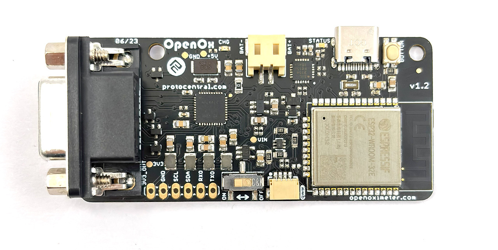
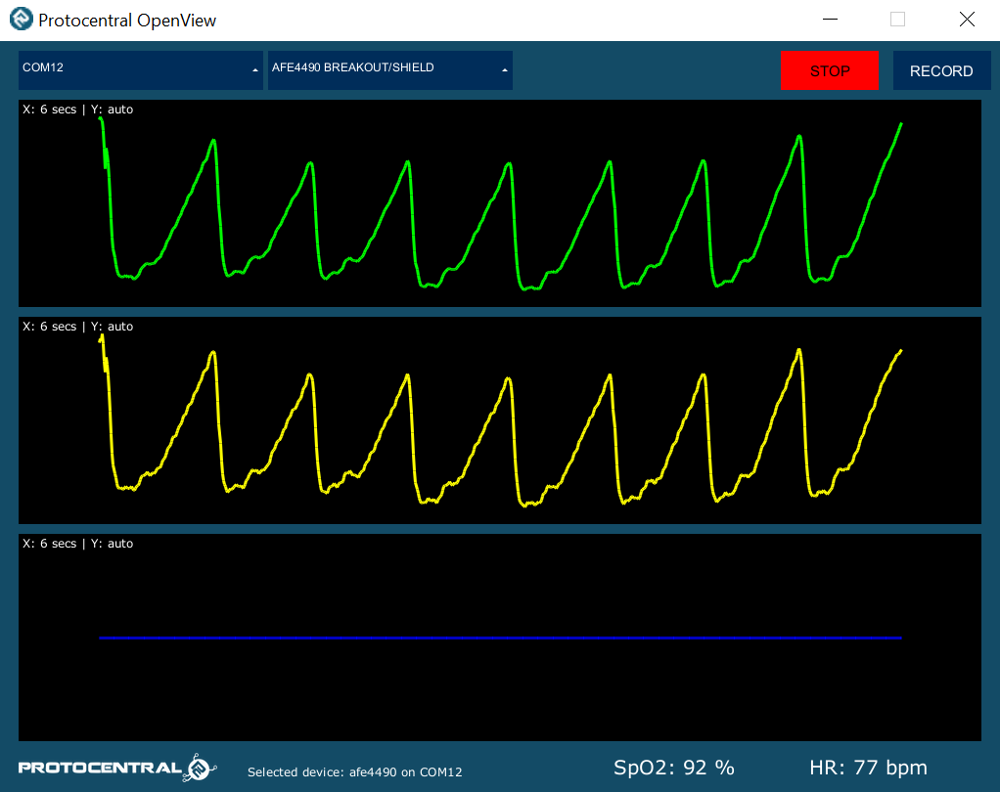
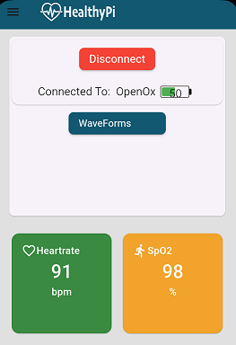
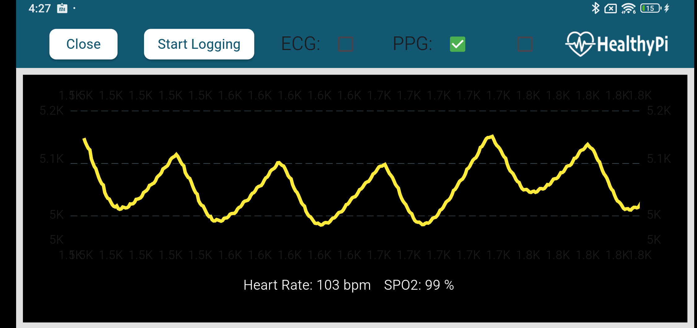

Protocentral OpenOx Wireless Pulse Sensor Kit based on AFE4400/ESP32
========================================

## Don't have one? [Buy it here](https://protocentral.com/product/protocentral-openox-pulse-oximeter-breakout-board-kit/)

Protocentral OpenOx is a new standalone, wireless pulse oximetry breakout board that is powered by the ubiquitous ESP32 WROOM32 module and uses the AFE4490 IC to measure oxygen levels in the blood while also providing a PPG waveform, heart rate, and SpO2 values measured with high precision. 

Protocentral OpenOx redefines mobility and wireless capabilities. It functions as a data acquisition system, allowing for continuous real-time monitoring of blood oxygen levels via BLE, which improves the user's medical care within his or her environment as well as medical research opportunities. The standard Nellcor probe is used, which is comfortable to wear, does not restrict the user's freedom of movement, and functions as a battery-powered standalone device.

## Hardware Setup

Connection with the Arduino board is as follows:

 |OpenOx pin label| Arduino Connection  |Pin Function      |
 |:-----------------: |:---------------------:|:------------------:|
 | Tx0              |  -                       |  Serial Data     |
 | RX0              |  -                        |  Serial Clock    |
 | SDA              |  SDA                        |  Power           |
 | SCL              |  SCL                      |  GND             |
 | GND              | GND                     |  Ground          |
 | 3V3              | 3V                      |  3V power supply |

# Visualizing Output

### USB Streaming

* Open the GUI, make sure to select **AFE4490 breakout** under the **Board** dropdown and the appropriate **Port**. If everything goes well, you will be able to see the screen as pictured above.

   

  

  

### BLE streaming

 

  

  

 

  

  

## For further details, refer [the documentation on OpenOx Wireless Pulse Sensor](https://docs.protocentral.com/getting-started-with-openox.md/)

License Information
===================

This product is open source! Both, our hardware and software are open source and licensed under the following licenses:

Hardware
---------

**All hardware is released under the [CERN-OHL-P v2](https://ohwr.org/cern_ohl_p_v2.txt)** license.

Copyright CERN 2020.

This source describes Open Hardware and is licensed under the CERN-OHL-P v2.

You may redistribute and modify this documentation and make products
using it under the terms of the CERN-OHL-P v2 (https:/cern.ch/cern-ohl).
This documentation is distributed WITHOUT ANY EXPRESS OR IMPLIED
WARRANTY, INCLUDING OF MERCHANTABILITY, SATISFACTORY QUALITY
AND FITNESS FOR A PARTICULAR PURPOSE. Please see the CERN-OHL-P v2
for applicable conditions

Software
--------

**All software is released under the MIT License(http://opensource.org/licenses/MIT).**

THE SOFTWARE IS PROVIDED "AS IS", WITHOUT WARRANTY OF ANY KIND, EXPRESS OR IMPLIED, INCLUDING BUT NOT LIMITED TO THE WARRANTIES OF MERCHANTABILITY, FITNESS FOR A PARTICULAR PURPOSE AND NONINFRINGEMENT. IN NO EVENT SHALL THE AUTHORS OR COPYRIGHT HOLDERS BE LIABLE FOR ANY CLAIM, DAMAGES OR OTHER LIABILITY, WHETHER IN AN ACTION OF CONTRACT, TORT OR OTHERWISE, ARISING FROM, OUT OF OR IN CONNECTION WITH THE SOFTWARE OR THE USE OR OTHER DEALINGS IN THE SOFTWARE.

Documentation
-------------
**All documentation is released under [Creative Commons Share-alike 4.0 International](http://creativecommons.org/licenses/by-sa/4.0/).**

You are free to:

* Share — copy and redistribute the material in any medium or format
* Adapt — remix, transform, and build upon the material for any purpose, even commercially.
The licensor cannot revoke these freedoms as long as you follow the license terms.

Under the following terms:

* Attribution — You must give appropriate credit, provide a link to the license, and indicate if changes were made. You may do so in any reasonable manner, but not in any way that suggests the licensor endorses you or your use.
* ShareAlike — If you remix, transform, or build upon the material, you must distribute your contributions under the same license as the original.

Please check [*LICENSE.md*](LICENSE.md) for detailed license descriptions.
